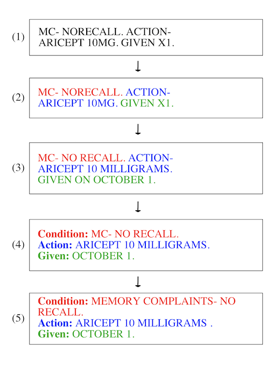

  <h2 align="center">NoteNinja: Parsing Doctor's Notes Quickly and Accurately</h3>

  

     Easily parse doctor's notes for patient conditions and medications. A command line tool(accepts user input using scanner class)
     
  <h3>Steps for Parsing</h3>
  <ol >
  <li>Tokenize the Free Text: <i>This is a string split by period, to allow for quicker processing of the following steps.</i></li>
    <li>Address Spelling Errors: <i>Doctor's notes are free text, and are entered quickly, meaning that spaces are omitted or words are one or two characters away from a recognized term.</i></li>
 <li>Recognize Special Forms: <i>Units, dates, and other forms follow special(non-abbreviation) forms.</i></li>
  <li>Split into Categories: <i>Three categories- condition, action, and date.</i></li>
 <li>Expand Abbreviations: <i>Medically recognized abbreviations, available in a dictionary.</i></li>
  </ol>
    <h3>Program Flow</h3>

  
      <h3>Why Do We Care?</h3>
Parsing free-text doctor's notes into machine-readable text can allow for easier use by machine learning models and more standardized efficiency for care providers. Because doctor's notes are written quickly without a set format, they can be difficult to understand for readers outside thee system
  

